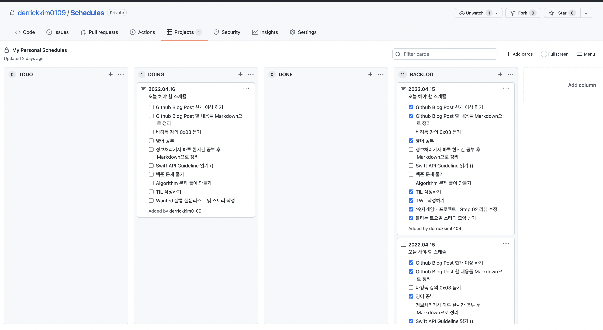

> 앞으로 진행 하게 될 모든 공부의 기록을 깃허브, 깃허브 블로그를 통해서 꼭 할 것이다. 오늘이 그 첫째 날이 되겠다!

# Github Projects 

- 내 스케쥴 등록을 어떻게 해야할지 고민을 많이 하였으나 Markdown연습에 도움도 되고 깃허브 이슈관리도 숙달하기 위해 내가 진행할 모든 공부를 따로 프로젝트를 파서 관리 할 것이다. 
ex) Algorithms_TIL, Yagom_TIL,..

- TODO, DOING, DONE 방식으로 진행하여 내가 공부한 부분들에 대해 기록 할 예정이다. 

- 아직 명확하게 어떤 부분이 더 도움이 될지..? 또 방식이 바뀔수도.. 있다..
